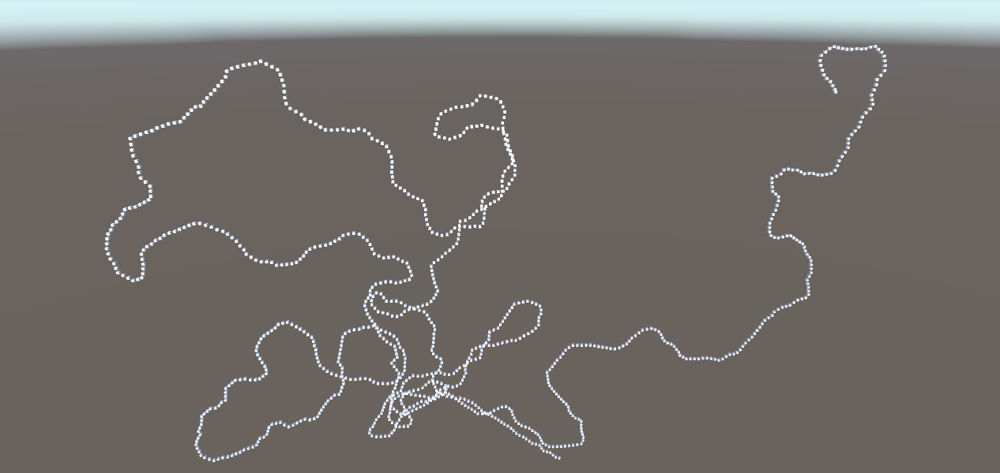

# RandomPath

Creates a random path. Use the static method to get a point from the list of a randomly
generated path.

- Use the function List<Vector3> CreatePath(startPos, numDecisions, startAngle, maxLength) to create a random path/curve.
- Use the function static GetPointFromPath(t[0 - 1], path) to get a point from a path/curve, it uses interpolation if the points are not defined.

